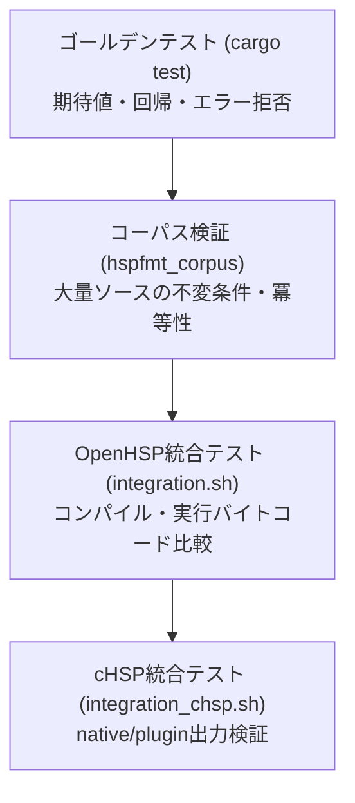

# hspfmt 設計思想と制約

`hspfmt` のアーキテクチャ、設計原則、言語仕様上の曖昧性に対するアプローチ、およびテスト・品質保証戦略についての技術ドキュメントです。

## 目次

- [基本設計原則](#基本設計原則)
  - [マクロ展開前ソースの直接整形](#マクロ展開前ソースの直接整形)
  - [独立性と移植性](#独立性と移植性)
  - [コンパイラではなくフォーマッタに徹する](#コンパイラではなくフォーマッタに徹する)
  - [推測による修復の拒否](#推測による修復の拒否)
- [ソース保持とトークン不変性](#ソース保持とトークン不変性)
  - [バイト範囲管理とトークン完全再現](#バイト範囲管理とトークン完全再現)
  - [改行コードと文字エンコーディングの保持](#改行コードと文字エンコーディングの保持)
  - [自己検証によるトークン不変性の担保](#自己検証によるトークン不変性の担保)
  - [原文を保持する構文要素](#原文を保持する構文要素)
- [HSP構文の曖昧性と診断警告](#hsp構文の曖昧性と診断警告)
  - [ラベル引数 vs 乗算代入 (`foo *bar`)](#ラベル引数-vs-乗算代入-foo-bar)
  - [配列代入 vs 命令呼び出し (`foo (a)=b`)](#配列代入-vs-命令呼び出し-foo-ab)
  - [Rust API での診断情報の取得](#rust-api-での診断情報の取得)
- [安全なファイル更新機構 (`--write`)](#安全なファイル更新機構---write)
  - [アトミックな置換手順](#アトミックな置換手順)
  - [無変更時のタイムスタンプ維持](#無変更時のタイムスタンプ維持)
  - [一括処理時の安全性担保](#一括処理時の安全性担保)
  - [リンクおよびアクセス権限の保護](#リンクおよびアクセス権限の保護)
- [テストと品質保証戦略](#テストと品質保証戦略)
  - [ゴールデンケースと単体テスト (cargo test)](#ゴールデンケースと単体テスト-cargo-test)
  - [コーパス検証ツール (hspfmt_corpus)](#コーパス検証ツール-hspfmt_corpus)
  - [OpenHSP連携統合テスト (integration.sh)](#openhsp連携統合テスト-integrationsh)
  - [cHSP統合テスト (integration_chsp.sh)](#chsp統合テスト-integration_chspsh)

---

## 基本設計原則

### マクロ展開前ソースの直接整形

多くのC系言語のフォーマッタと異なり、HSP（Hot Soup Processor）ではプリプロセッサによる `#define` マクロが構文構造やキーワードの定義に広く使われています。しかし、ソースコードを整形する目的においては、プログラマが記述した「マクロ展開前の原文」の構造を維持しながら整形することが不可欠です。

`hspfmt` はマクロ展開やヘッダインクルードを行わず、ユーザーが書いたソースコードを直接字句解析・整形します。

### 独立性と移植性

`hspfmt` はOpenHSPのコンパイラやランタイムライブラリに一切依存せず、Rust標準ライブラリのみ（外部依存ゼロ）で構築されています。Windows、Linux、macOSなどの主要な環境で単一のCargo手順からビルドでき、外部依存なしに自己完結して動作します。

### ライブラリのモジュールと中間表現

`src/lib.rs` は公開APIの窓口です。文字コード処理は `encoding`、字句解析は `lexer`、
ブロック状態の追跡は `parser`、整形パスは `formatter`、設定とオプションは `config` / `options`、
エラーは `error` に分けています。

全パスは `document` のトークン列を受け渡します。トークンのテキストと行内空白は
`Cow<[u8]>` で扱い、未変更の部分は入力バイト列を参照します。
全角スペース、コメント、行内整形、複数行if、宣言レイアウトの各処理間で、
ソース全体をバイト列へ書き戻して再lexすることはありません。
全角スペースで分割されたWordと隣接トークンの分類と、行内整形結果の安全性照合では局所的にlexします。
文字コードは入口で一度だけ解決し、内部には `Auto` を持たない型で渡します。

`format_utf8(&str, ...)` はUTF-8の確定した入力用です。
エラーの行番号は `Option<usize>` で表し、字句エラーの検出位置や構造エラーの行先頭を
バイトオフセットとして返します。診断警告は原文の行先頭位置と種別も返します。
設定ファイルの解析と探索の優先順位はライブラリで扱いますが、存在確認や読み込みは
呼び出し元へ委譲します。ライブラリはOSのファイルI/Oやスレッドに依存しません。
CIではライブラリのwasm32ビルドも検査します。

### コンパイラではなくフォーマッタに徹する

完全な具象構文木（CST）の構築や型チェック、識別子の名前解決は行いません。文境界、演算子、コロン区切り、および標準的なブロック構造（`if`、`repeat/loop`、`while/wend`、`for/next`、`switch/case`、`#module/#global`、`#deffunc` 等）を認識する、小さく堅牢な解析器として設計されています。

これにより、解析オーバーヘッドを最小限に抑え、ミリ秒単位の極めて高速なフォーマットを実現しています。

### 推測による修復の拒否

HSPコンパイラは利便性のため、文法的に不完全なコード（例: 閉じ引用符 `"` のない文字列リテラル、`#endif` のない `#if`）を行末やファイル末尾で暗黙的に補完してコンパイルを通す仕様を持っています。

しかし、フォーマッタが推測によってこれらを修復しようとすると、プログラマの意図しないコード改変やバグの温床となります。そのため `hspfmt` は、このような文法的に不完全な構造を発見した場合は推測で整形せず、エラーとして安全に拒否（非ゼロの終了コードで中断）します。

---

## ソース保持とトークン不変性

### バイト範囲管理とトークン完全再現

`hspfmt` の字句解析器（Lexer）は、ソースコード内の全トークン（空白、改行、コメント、BOMを含む）を元ソース上の正確なバイト範囲（オフセットと長さ）として管理します。
エスケープシーケンスの暗黙的な展開や再生成は行わず、整形対象外の部分は入力されたバイト列をそのまま出力します。

### 改行コードと文字エンコーディングの保持

- **改行形式**: Windows環境の `CRLF`（`\r\n`）とUnix環境の `LF`（`\n`）を自動検出し、混在行やファイル全体の改行形式を維持します。また、ファイル末尾の改行の有無も完全に保持します。
- **エンコーディング**: UTF-8とCP932（Shift_JIS）をサポートし、既定で高精度な自動判定を行います。UTF-8 BOMの検出に加え、全バイト列の妥当性スキャンにより、BOMなしUTF-8とCP932を確実に判別します。複数ファイル処理時もファイル単位で個別に自動判定されます。フォーマッタ内部で文字コード変換（トランスコード）は一切行いません。CP932モードでは、2バイト目に `0x5C`（ASCIIのバックスラッシュと同値）を含む漢字（「表」「能」など）を引用符やエスケープ、行継続と誤認しないよう厳密に文字境界を判定します。

### 自己検証によるトークン不変性の担保

通常整形（構文変換オプションを指定しない整形）では、空白の追加・除去によってトークンの区切りが変化していないかを検証するため、整形結果に対して内部で自動的に再字句解析を実行します。

非空白トークンの並びが原文と完全に一致しない場合、それはフォーマッタの内部バグとみなして出力を破棄し、エラーを発生させます。

### 原文を保持する構文要素

以下のようなコンパイラ・マクロ依存度が高い構文や複雑な要素は、安全のため原文の記述をそのまま保持します。

- プリプロセッサ行（`#` で始まるディレクティブ行。ただし標準的な `#deffunc`・`#defcfunc` のカンマ周辺と手前空行数は除く）
- 行継続（`\` で次行へ続く文）
- 複数行文字列（`{" ... "}`）
- 複数行コメント（`/* ... */`。ただし `--block-comments=lines` 指定時を除く）
- 整形除外コメントで囲まれた区間（`; hspfmt: off` 〜 `; hspfmt: on`）

---

## HSP構文の曖昧性と診断警告

HSP言語の柔軟な文法には、マクロ展開や名前解決を行わない静的字句解析の段階では構文木を一意に特定できない曖昧なパターンが存在します。

### ラベル引数 vs 乗算代入 (`foo *bar`)

HSPでは、以下の記述が2通りの解釈を持ちます。

```hsp
foo *bar
```

1. ユーザー定義命令 `foo` に対するラベル引数 `*bar`
2. 変数 `foo` に対する、旧来の乗算代入構文（`foo = foo * bar` 相当）

この曖昧性に対し、`hspfmt` は以下のように対処します。

- `*` の前後の空白を**あえて変更せず原文のまま保持**します。
- 原文の空白配置が、ユーザーの指定した演算子空白ルール（例: `--operator-spacing=space`）と異なる場合、標準エラー出力に診断警告を出力します。

```text
script.hsp:10: warning: ambiguous label or multiplication; preserving whitespace
foo*bar
```

これにより、コードの意味を壊す危険を回避しつつ、コード作成者に曖昧な記述の存在を通知します。なお、この警告は終了コードには影響しません。

### 配列代入 vs 命令呼び出し (`foo (a)=b`)

文頭の `foo (a)=b` は、配列変数への代入とも、命令 `foo` に引数 `(a)=b`（等価比較式）を渡す呼び出しとも解釈できます。

`hspfmt` は命令と変数の名前解決を行わないため、このような曖昧なケースでは文頭の識別子に続く最初の演算子の解釈を安全側に倒し、原文の意図を破壊しないよう慎重にトークンを配置します。

### Rust API での診断情報の取得

Rustライブラリとして `hspfmt` を組み込む場合、診断情報（Diagnostics）をベクターとして受け取ることができます。

```rust
use hspfmt::{format, Diagnostic, Options, Spacing};

let mut diagnostics = Vec::new();
let mut options = Options::default();
options.operator_spacing = Spacing::Space;

let formatted = format(source, &options, Some(&mut diagnostics))?;

for diag in diagnostics {
    eprintln!("Line {}: warning: ambiguous label or multiplication; preserving whitespace", diag.line);
}
```

---

## 安全なファイル更新機構 (`--write`)

ファイルを直接上書きする `--write`（`-w`）オプションは、不慮の電源断、ディスク満杯、構文エラーなどによるソースコードの消失を防ぐため、徹底した多段防御を行っています。

### アトミックな置換手順

1. 整形対象ファイルと同じディレクトリ配下に、専用の一時ディレクトリとファイル（例: `.hspfmt-12345/output`）を作成します。同一ファイルシステム上に配置することで、アトミックなリネームを可能にします。
2. 整形結果を一時ファイルにすべて書き込み、正常にフラッシュ（同期）してファイルをクローズします。
3. 書き込みが完全に完了した後、OSのアトミックなファイル置換API（POSIX `rename`、Windows `ReplaceFileW`）を用いて元のファイルを一瞬で置き換えます。
4. Unixでは一時ディレクトリを片付けてから元ファイルの親ディレクトリを同期し、置換の耐久性を高めます。

Unixのパーミッションは一時ファイルを同期する前に設定します。
置換後の親ディレクトリ同期に失敗した場合、内容の置換は完了しています。
この場合は「置換済みだが同期に失敗した」エラーを返します。置換前の失敗では原文を保持します。

> [!WARNING]
> シェルのリダイレクト機能を使った上書き（例: `hspfmt file.hsp > file.hsp`）は、シェルが `hspfmt` の実行前に入力ファイルをサイズ0に切り詰めてしまうため、元コードが完全に消失します。ファイルの上書きには必ず `--write` を使用してください。

### 無変更時のタイムスタンプ維持

整形前と整形後で内容に差分がない場合、`--write` はファイルへの書き込みを行いません。ファイルの最終更新日時（mtime）も更新されないため、ビルドシステム（MakeやCMake）の不要な再ビルドを誘発しません。

### 一括処理時の安全性担保

複数ファイルを指定して `--write` を実行した場合、すべての入力ファイルの読み込み・字句解析・構文検査が正常に完了するまで、**どのファイルに対しても実際の書き換えを行いません**。1つでもエラーのあるファイルが含まれていた場合、処理全体を中断し、すべてのファイルを元のまま残します。

### リンクおよびアクセス権限の保護

- Unixでは元ファイルのパーミッションを一時ファイルへ引き継ぎ、失敗した場合は置換を行いません。Windowsでは `ReplaceFileW` により元ファイルのACLと属性を保持します。
- 安全のため、シンボリックリンク、複数のハードリンクが存在するファイル、および標準入力は `--write` による上書き対象から除外されます。

---

## テストと品質保証戦略

`hspfmt` では4層のテスト体系によってフォーマッタの正確性と安全性を検証しています。



### ゴールデンケースと単体テスト (cargo test)

`test/cases/` 配下の個別テストケース群および `test/run_tests.py` は、すべてのオプション組み合わせ、境界条件、回帰バグ、文字コードの挙動を網羅した数百のテストケースを実行します（`cargo test` 経由でも自動実行されます）。
各テストケースにおいて以下の不変条件を検証します。

1. **ラウンドトリップ性**: `lex(input)` のトークン連結結果が `input` と1バイトの狂いもなく完全一致すること。
2. **期待出力一致**: 整形結果が期待される文字列と一致すること。
3. **冪等性（Idempotence）**: 1回整形した結果を再度整形したとき、結果が完全に一致すること（`format(format(x)) == format(x)`）。

### コーパス検証ツール (hspfmt_corpus)

`src/bin/corpus.rs` は、指定されたディレクトリツリー内のすべてのHSPソース（`.hsp`, `.as`, `.chsp`）を再帰的に走査し、実世界の大量のコードに対して以下の不変条件を検証するツールです。

- **非空白トークンの完全一致**: 整形によってコードの意味（トークンの内容と順序）が変わっていないこと。
- **冪等性**: すべてのファイルで2回目の整形で差分が出ないこと。

任意のオープンソースHSPプロジェクトやOpenHSP付属のサンプルコード群を引数に渡して即座に検証できます。

```sh
cargo run --release --bin hspfmt_corpus /path/to/OpenHSP/sample
```

対象ファイルが1件も見つからない場合は終了ステータス2で失敗します。

### 差分ファジング (diff_fuzz.py)

`test/diff_fuzz.py` は、基準となる別リビジョンのビルドと現在のビルドへ同じランダム入力・オプションを与え、標準出力・標準エラー出力・終了ステータスの一致を検証します。振る舞いを変えないリファクタリングの確認に使います。

```sh
python3 test/diff_fuzz.py /path/to/baseline/hspfmt target/release/hspfmt 5000
```

### OpenHSP連携統合テスト (integration.sh)

Linux環境において、OpenHSPの公式コンパイラ（`hspcmp`）とCUIランタイム（`hsp3cl`）を実際に呼び出し、以下のプロセスで検証します。

1. 原文のソースコードをコンパイルして実行し、標準出力を記録する。
2. `hspfmt` の各オプションおよび複合オプションでソースを整形する。
3. 整形後のソースを同じコンパイラでコンパイルして実行し、実行結果が原文と完全に一致するかを比較検証する。

これにより、「整形でプログラムの実行時挙動が変わらないこと」を外部ツールから客観的に保証します。

### cHSP統合テスト (integration_chsp.sh)

cHSP（ネイティブ拡張）環境を対象に、`target=c` および `target=plugin` の両モードでコンパイル・Cコンパイラビルドを実行し、整形前後で出力が同一であることを検証します。
